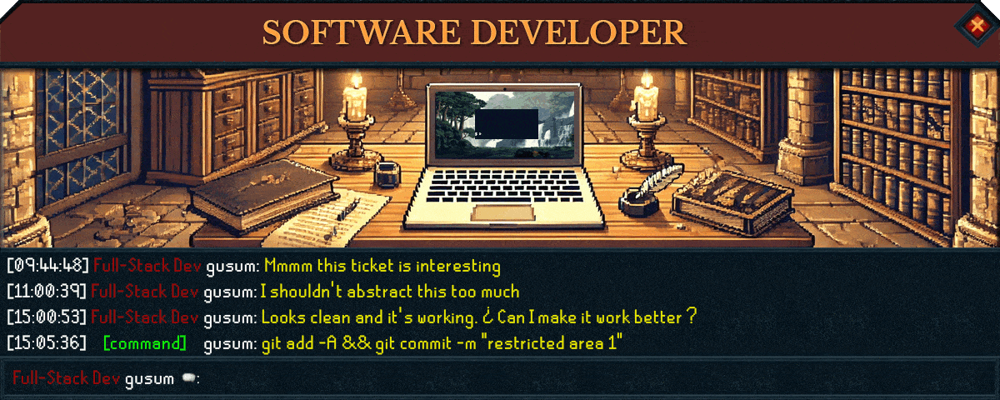

<h1 align="left">¡Hello! My name is Ariel</h1>

###

<h4 align="left">Full Stack Software Developer</h4>

###

  

###
<ul>
    <li>🙋 I'm Ariel Agustin Alvaro, also known as gusum in the internet 🌎</li<>
    <li>❤️ I am passionate about programming because it gives me the ability to create and build innovative ⚙️ solutions</li<>
    <li>💻 My interest in computer science began around 2018, working on projects at my school, and later, I entered university to deepen my knowledge even further</li<>
    <li>🔥 Nowadays, I continue to actively expand my knowledge 📚 through self-learning and with the help of my colleagues, aiming to become more proficient and enhance my efficiency and productivity.</li<>

</ul>

###

<h3 align="left">My github stats 📊</h3>

###

  

###